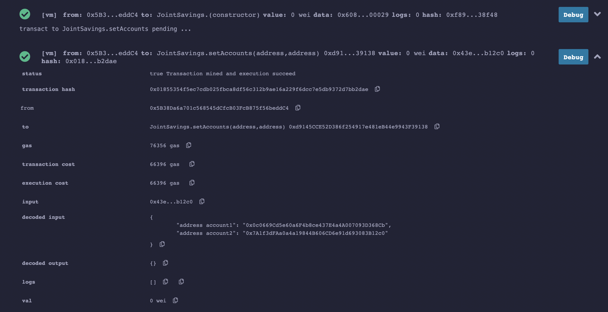
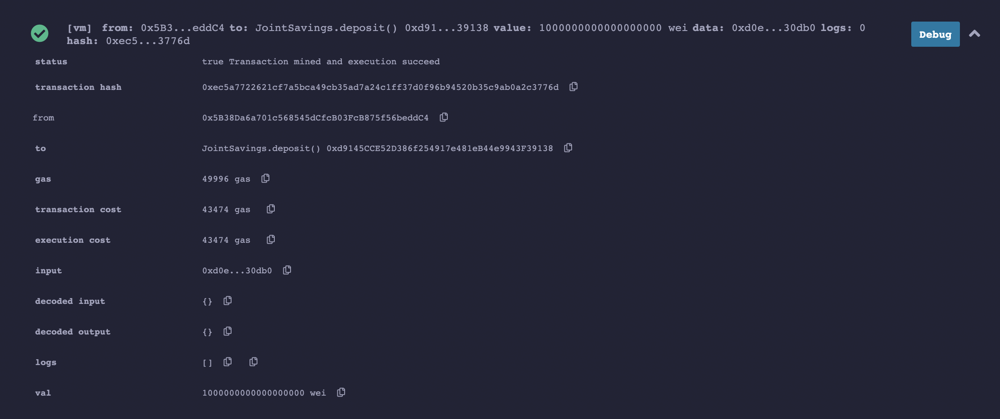
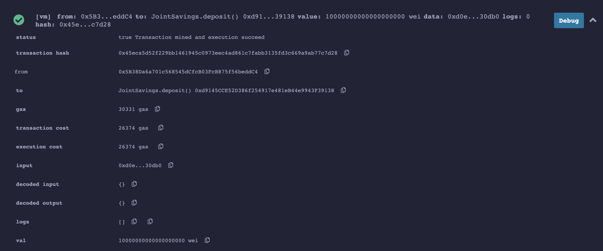
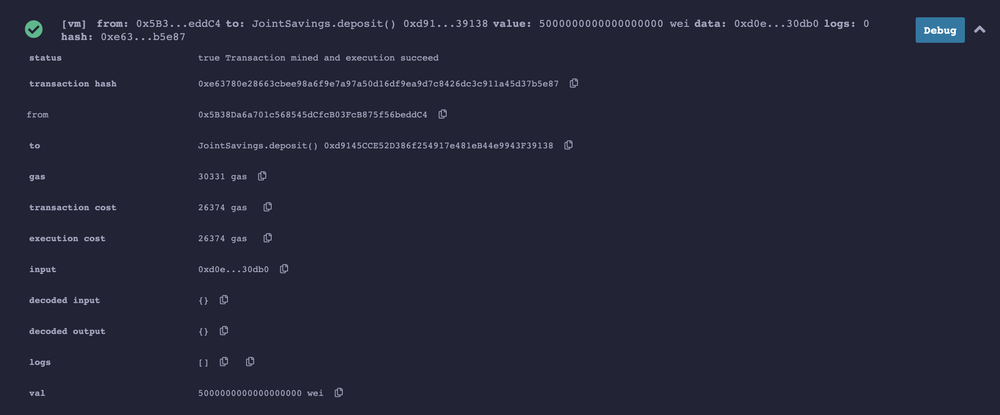
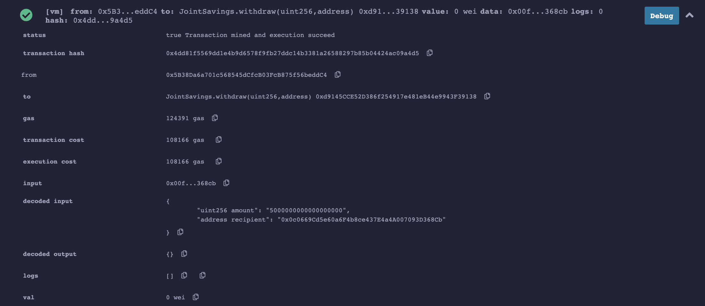
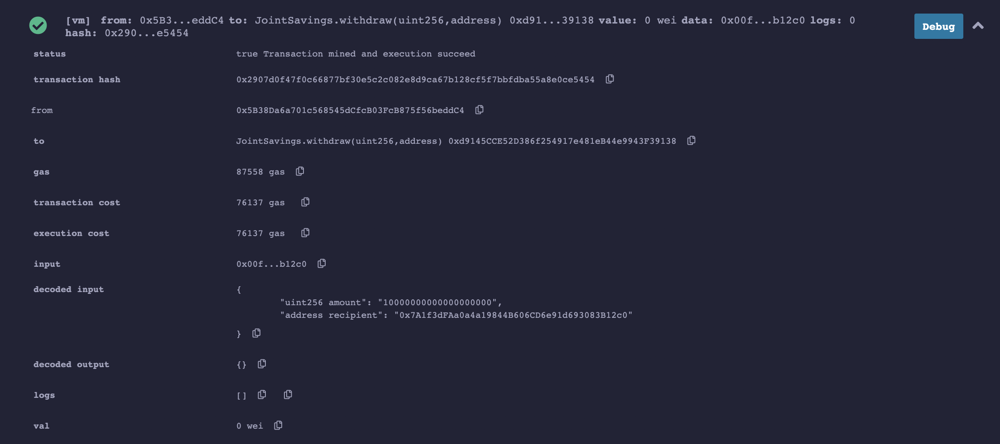
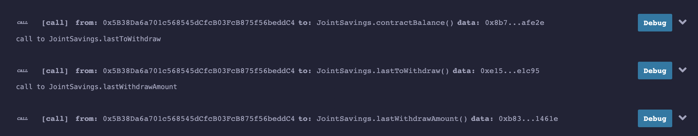

# Joint_Savings_Account

A soldity contract that allows users to deposit their money and set spcific withdraw addresses so that they can ensure their money won't be stolen!

## Development
This contract was developed using remix and deployed using 

## Deployment
Requires Solidity > 0.5.0  
Compiled using COMPILER + version 0.5.1  
Deployed Using JavaScript VM  

## Contract In Action

### Setting Withdraw Addresses

### Depositing ETH

### Withdrawing ETH

### Checking Account Status

